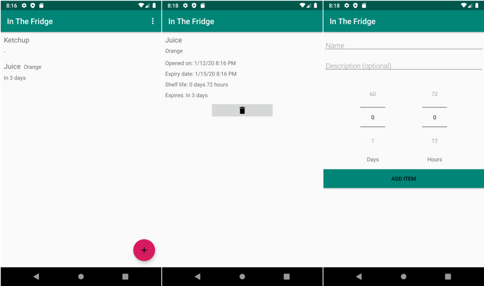

# In The Fridge
Android app for tracking how long food has been sitting in the fridge.

## Rationale

The app aims to solve a real world problem: deciding whether an opened package of food has been sitting in the fridge longer
than recommended (my memory never serves me for that purpose). Obviously, fridge tracking applications already exist,
but I wanted to have something minimal and without ads. Also, I was curious how hard creating a functional Android app would be.

## Project status

The app is intended for personal use. It was created as a pastime. It has reached minimal functionality and will be developed
slightly more (mostly to improve the UI as it is somewhat lacking). There are no plans for distribution.

## Acknowledgements

Development was largely based on the
[Android Room with a View](https://codelabs.developers.google.com/codelabs/android-room-with-a-view-kotlin/#0) codelab.
